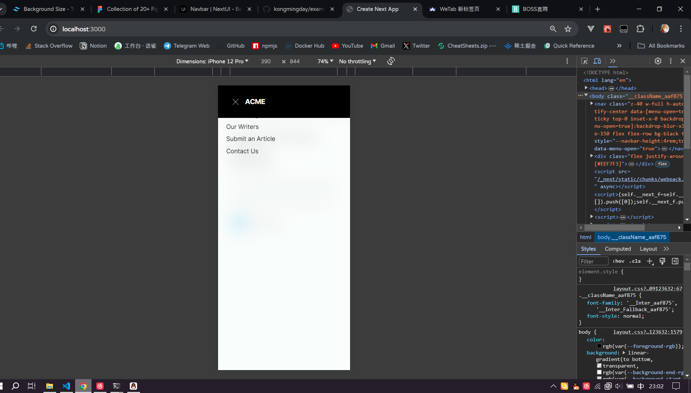

## 启动

```bash
npm run dev
# or
yarn dev
```

## 参考

https://www.figma.com/design/zPNyZ78hzX4OxlVrWJhE6U/Collection-of-20%2B-Figma-Hero-Section-Templates-(Community)?node-id=1-2772&t=IKKekorCo7XBHpfh-0


## 效果

1. web 基本布局 (替换部分元素)
   

2. 移动端基本布局
   

3. 移动端菜单适配
   
